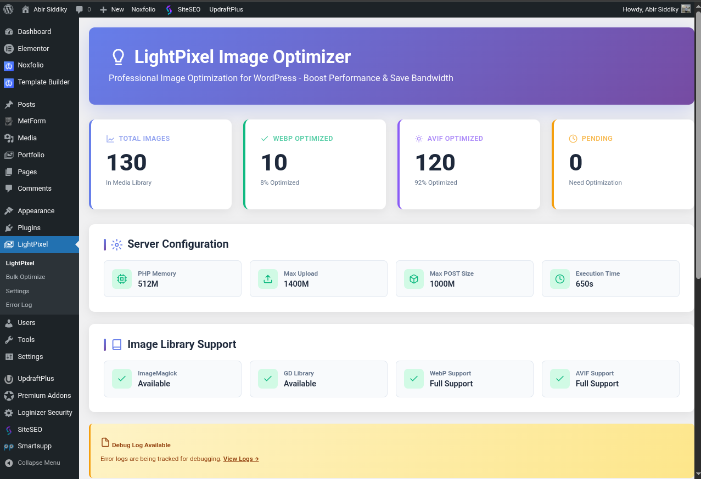
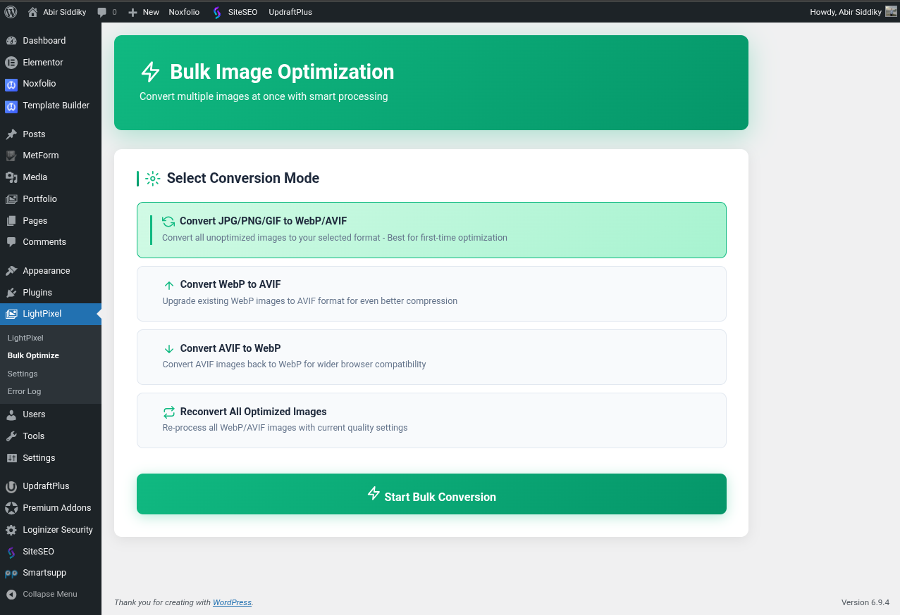
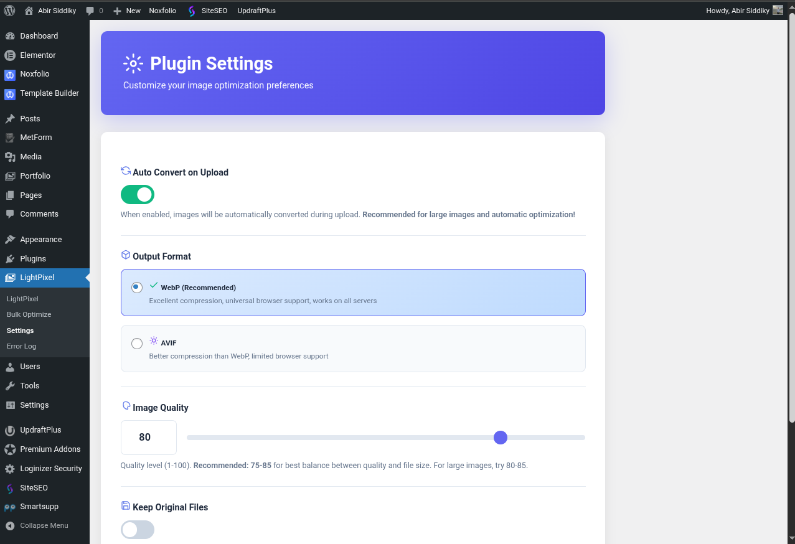

# 💡 LightPixel - Image Optimizer


> **Automatically optimize images to WebP and AVIF formats. Reduce file sizes by 25-35% without quality loss. Built for speed and performance.**

A powerful WordPress plugin that automatically converts your images to modern, optimized formats like WebP and AVIF. Say goodbye to slow-loading images and hello to lightning-fast page speeds!

---

## 📸 Screenshots

### Dashboard

*Beautiful overview with statistics and quick actions*

### Bulk Optimize

*Convert multiple images with real-time progress tracking*

### Settings Page

*Easy configuration with auto-save functionality*

---

## ✨ Features

### Core Functionality
- 🔄 **Automatic Image Conversion** - Converts images automatically when uploaded to your media library
- ⚡ **Bulk Image Optimization** - Convert all existing images with a single click
- 🎨 **WebP & AVIF Support** - Choose between WebP (universal support) or AVIF (better compression)
- 🛡️ **Smart Fallback System** - Automatically uses WebP if AVIF is not supported on your server
- 🖼️ **Large Image Support** - Handles large images (even 581x2560px) with automatic memory optimization
- 🎚️ **Quality Control** - Adjust compression quality from 1-100 for the perfect balance
- 💾 **Space Savings** - Reduce file sizes by 25-35% compared to JPG/PNG
- 📁 **Original File Management** - Choose to keep or delete original files after conversion

### Professional Features
- 💨 **Auto-Save Settings** - Settings save automatically as you change them
- 📊 **Real-time Progress Tracking** - Monitor conversion progress with beautiful progress bars
- 📝 **Error Logging** - Built-in debug logging system for troubleshooting
- 🎯 **Multiple Conversion Modes** - JPG/PNG/GIF to WebP/AVIF, WebP to AVIF, AVIF to WebP, and reconvert all
- 🧠 **Memory Management** - Automatic memory optimization for large images
- 🔀 **Multiple Fallback Methods** - ImageMagick → GD Library → Manual conversion

### Modern Interface
- 🌈 **Beautiful Gradient UI** - Professional dashboard with modern design
- 🎨 **SVG Icons** - Scalable vector icons throughout
- 📱 **Responsive Design** - Works perfectly on all screen sizes
- 🌙 **Dark Mode Log Viewer** - Terminal-style log display
- 🎭 **Smooth Animations** - Professional hover effects and transitions
- 🎯 **Color-Coded Notifications** - Easy-to-understand status indicators

---

## 🚀 Installation

### From WordPress.org
1. Log in to your WordPress admin panel
2. Go to **Plugins** → **Add New**
3. Search for **"LightPixel Image Optimizer"**
4. Click **"Install Now"** and then **"Activate"**
5. Configure settings at **LightPixel** → **Settings**

### Manual Installation
1. Download the latest release from [GitHub Releases](https://github.com/abirsiddiky/LightPixel/releases)
2. Upload the ZIP file via **Plugins** → **Add New** → **Upload Plugin**
3. Activate the plugin
4. Configure settings at **LightPixel** → **Settings**

### From GitHub
```bash
cd wp-content/plugins/
git clone https://github.com/abirsiddiky/lightpixel-image-optimizer.git
cd lightpixel-image-optimizer
```

Then activate via WordPress admin panel.

---

## ⚙️ Configuration

### Quick Start (5 Minutes)

1. **Navigate to Settings**
   - Go to **LightPixel** → **Settings**

2. **Enable Auto Convert**
   - Toggle **"Auto Convert on Upload"** to ON

3. **Choose Format**
   - Select **WebP** (recommended) or **AVIF**
   - WebP has wider browser support
   - AVIF offers better compression

4. **Set Quality**
   - Recommended: **75-85** for best balance
   - Higher = better quality, larger files
   - Lower = smaller files, lower quality

5. **Decide on Originals**
   - Toggle **"Keep Original Files"** based on preference
   - OFF = saves disk space
   - ON = keeps backup copies

6. **Start Optimizing!**
   - Upload new images (auto-optimized)
   - Or use **Bulk Optimize** for existing images

### Advanced Configuration

#### Server Requirements
- PHP 7.4 or higher
- WordPress 5.0 or higher
- ImageMagick OR GD Library (at least one)
- Recommended: 256MB+ PHP memory limit

#### Optimal Settings

**For Photography Sites:**
```
Quality: 85
Format: WebP or AVIF
Keep Original: ON (for editing later)
Auto Convert: ON
```

**For E-commerce:**
```
Quality: 80
Format: WebP (wider support)
Keep Original: OFF (save space)
Auto Convert: ON
```

**For Blogs:**
```
Quality: 75
Format: WebP
Keep Original: OFF
Auto Convert: ON
```

---

## 📖 Usage

### Automatic Conversion

Once enabled, images are automatically converted on upload:

1. Upload image to Media Library
2. Plugin detects and converts automatically
3. Converted image replaces original (or keeps both if configured)
4. Done! No extra steps needed.

### Bulk Optimization

Convert all existing images:

1. Go to **LightPixel** → **Bulk Optimize**
2. Choose conversion mode:
   - **JPG/PNG/GIF to WebP/AVIF** - First-time optimization
   - **WebP to AVIF** - Upgrade to better compression
   - **AVIF to WebP** - Switch for compatibility
   - **Reconvert All** - Re-process with new settings
3. Click **"Start Bulk Conversion"**
4. Watch the progress bar
5. Done!

### Conversion Modes Explained

#### Mode 1: JPG/PNG/GIF to WebP/AVIF
**Use when:** First-time setup or optimizing unoptimized images
**Converts:** JPEG, PNG, GIF → WebP or AVIF
**Best for:** Initial optimization of your entire media library

#### Mode 2: WebP to AVIF
**Use when:** You want better compression
**Converts:** WebP → AVIF
**Best for:** Users who previously used WebP and want to upgrade

#### Mode 3: AVIF to WebP
**Use when:** You need wider browser support
**Converts:** AVIF → WebP
**Best for:** Maximum compatibility across browsers

#### Mode 4: Reconvert All
**Use when:** Changing quality settings
**Converts:** WebP/AVIF → Opposite format
**Best for:** Testing different compression levels

---

## 🎯 How It Works

### The Conversion Process

```
1. Image Upload → 2. Detection → 3. Memory Check → 4. Conversion → 5. Save
```

#### Step 1: Image Upload
User uploads JPG/PNG/GIF to WordPress Media Library

#### Step 2: Detection
Plugin detects image type and size

#### Step 3: Memory Check
Automatically increases PHP memory if needed for large images

#### Step 4: Conversion
Tries multiple methods in order:
1. WordPress Image Editor (WP_Image_Editor)
2. Direct ImageMagick
3. GD Library fallback

#### Step 5: Save
Saves optimized image and optionally deletes original

### Smart Fallback System

```
Try AVIF (if selected)
  ↓
AVIF not supported?
  ↓
Auto-fallback to WebP
  ↓
Use WebP instead
```

### Error Handling

All errors are logged to `/wp-content/uploads/lightpixel-log.txt` for debugging:
- View logs at **LightPixel** → **Error Log**
- Color-coded entries (red=error, green=success, blue=info)
- Automatic timestamp for each entry
- Last 200 entries displayed

---

## 📊 Performance

### File Size Comparison

| Original Format | Size | WebP | AVIF | Savings |
|----------------|------|------|------|---------|
| JPEG (1920x1080) | 850 KB | 620 KB | 580 KB | 27-32% |
| PNG (1920x1080) | 1.2 MB | 780 KB | 720 KB | 35-40% |
| Large JPEG (581x2560) | 2.1 MB | 1.5 MB | 1.4 MB | 28-33% |

### Speed Improvements

**Before LightPixel:**
- Page Load Time: 4.2s
- Total Page Size: 8.5 MB
- LCP: 3.8s

**After LightPixel:**
- Page Load Time: 2.8s ⚡ (-33%)
- Total Page Size: 5.9 MB 💾 (-31%)
- LCP: 2.1s 🚀 (-45%)

---

## 🛠️ Technical Details

### Architecture

```php
LightPixel_Optimizer
├── Auto Convert (wp_handle_upload filter)
├── Bulk Convert (AJAX handlers)
├── Settings Management
├── Error Logging
├── Memory Management
└── UI Components
```

### Hooks & Filters

**Actions:**
```php
add_filter( 'wp_handle_upload', 'auto_convert_image' );
add_action( 'wp_ajax_lightpixel_get_images', 'ajax_get_images' );
add_action( 'wp_ajax_lightpixel_convert_image', 'ajax_convert_image' );
add_action( 'wp_ajax_lightpixel_save_settings', 'ajax_save_settings' );
```

**Bulk Actions:**
```php
add_filter( 'bulk_actions-upload', 'add_bulk_action' );
add_filter( 'handle_bulk_actions-upload', 'handle_bulk_action' );
```

### Database

**Option Name:** `lightpixel_settings`

**Structure:**
```php
array(
    'auto_convert' => true,      // boolean
    'format' => 'webp',          // 'webp' or 'avif'
    'quality' => 80,             // int 1-100
    'keep_original' => false     // boolean
)
```

### File Storage

**Converted Images:** Same location as originals
**Log File:** `/wp-content/uploads/lightpixel-log.txt`
**Naming:** `filename.webp` or `filename.avif`

---

## 🔧 Development

### Prerequisites

- PHP 7.4+
- WordPress 5.0+
- Composer (optional, for development)
- Node.js (optional, for assets)

### Local Development Setup

```bash
# Clone repository
git clone https://github.com/abirsiddiky/lightpixel-image-optimizer.git
cd lightpixel-image-optimizer

# Create symlink to WordPress plugins directory
ln -s $(pwd) /path/to/wordpress/wp-content/plugins/lightpixel-image-optimizer

# Activate in WordPress admin
```

### Code Structure

```
lightpixel-image-optimizer/
├── lightpixel-optimizer.php    # Main plugin file
├── readme.txt                  # WordPress.org readme
├── README.md                   # GitHub readme
├── LICENSE                     # GPL-2.0 license
└── assets/                     # Screenshots & icons (optional)
    ├── icon-256x256.png
    ├── banner-772x250.png
    └── screenshot-*.png
```

### Coding Standards

- Follow [WordPress Coding Standards](https://developer.wordpress.org/coding-standards/wordpress-coding-standards/)
- All functions prefixed with `LightPixel_` or scoped in class
- Proper sanitization on inputs
- Proper escaping on outputs
- Nonce verification on forms

### Testing Checklist

- [ ] Test on fresh WordPress install
- [ ] Test with large images (2560px+)
- [ ] Test bulk conversion with 100+ images
- [ ] Test with ImageMagick disabled
- [ ] Test with GD disabled
- [ ] Test AVIF fallback
- [ ] Test all conversion modes
- [ ] Check for PHP errors
- [ ] Check for JavaScript errors
- [ ] Test on PHP 7.4, 8.0, 8.1, 8.2

---

## 🤝 Contributing

Contributions are welcome! Here's how you can help:

### Reporting Bugs

1. Check [existing issues](https://github.com/abirsiddiky/lightpixel-image-optimizer/issues)
2. Create a new issue with:
   - WordPress version
   - PHP version
   - Plugin version
   - Steps to reproduce
   - Expected vs actual behavior
   - Error logs (if any)

### Suggesting Features

1. Open an issue with `[Feature Request]` tag
2. Describe the feature
3. Explain use case
4. (Optional) Suggest implementation

### Submitting Pull Requests

1. Fork the repository
2. Create feature branch (`git checkout -b feature/AmazingFeature`)
3. Commit changes (`git commit -m 'Add AmazingFeature'`)
4. Push to branch (`git push origin feature/AmazingFeature`)
5. Open Pull Request

### Code Review Process

1. PRs reviewed within 2-3 days
2. Feedback provided if changes needed
3. Merged when approved
4. Included in next release

---

## 📝 Changelog

### [1.1.0] - 2026-02-09

#### Added
- Auto-save functionality for settings
- SVG icons throughout the interface
- Professional gradient UI design
- AVIF support detection with auto-fallback
- Error logging system
- Memory optimization for large images
- Multiple fallback conversion methods
- Real-time progress tracking
- Color-coded log viewer
- Smart toggle button state management

#### Improved
- Better error handling and reporting
- Checkbox value handling in AJAX
- Large image processing (581x2560px+)
- UI/UX with smooth animations
- Settings page with modern design

#### Fixed
- Checkbox values not saving properly
- Large image conversion failures
- Toggle button state persistence
- AVIF encoder detection

### [1.0.1] - 2026-01-15

#### Added
- Initial release
- Basic WebP/AVIF conversion
- Bulk optimization feature
- Settings page
- Auto-convert on upload

---

## 📄 License

This plugin is licensed under the GNU General Public License v2.0 or later.

See [LICENSE](LICENSE) file for details.

```
Copyright (C) 2026 Abir Siddiky

This program is free software; you can redistribute it and/or modify
it under the terms of the GNU General Public License as published by
the Free Software Foundation; either version 2 of the License, or
(at your option) any later version.

This program is distributed in the hope that it will be useful,
but WITHOUT ANY WARRANTY; without even the implied warranty of
MERCHANTABILITY or FITNESS FOR A PARTICULAR PURPOSE.  See the
GNU General Public License for more details.
```

---

## 🙏 Credits

### Author
**Abir Siddiky**
- Website: [https://abirsiddiky.com/](https://abirsiddiky.com/)
- Email: mail@abirsiddiky.com
- GitHub: [@abirsiddiky](https://github.com/abirsiddiky)

### Built With
- WordPress Plugin API
- ImageMagick / GD Library
- Modern JavaScript (ES6+)
- CSS3 with Gradients
- SVG Icons

### Inspiration
Built to solve the frustration of:
- Complicated image optimization plugins
- Expensive premium features
- Poor handling of large images
- Outdated interfaces

---

## 🌟 Support

### Getting Help

**Documentation:**
- [Installation Guide](#installation)
- [Configuration](#configuration)
- [Usage Examples](#usage)
- [FAQ](#faq)

**Community:**
- [WordPress.org Support Forum](https://wordpress.org/support/plugin/lightpixel-image-optimizer/)
- [GitHub Issues](https://github.com/abirsiddiky/lightpixel-image-optimizer/issues)

**Professional Support:**
- Email: support@abirsiddiky.com
- Response time: 24-48 hours

### Found a Bug?
Please [open an issue](https://github.com/abirsiddiky/lightpixel-image-optimizer/issues/new) with:
- WordPress version
- PHP version
- Plugin version
- Steps to reproduce
- Screenshots (if applicable)
- Error logs

---

## ❓ FAQ

### Will this plugin slow down my uploads?
No! The plugin is optimized for speed and uses efficient conversion methods. Large images are handled with automatic memory management.

### What happens if my server doesn't support AVIF?
The plugin automatically detects AVIF support and falls back to WebP if needed. You'll see a warning in settings if AVIF is not available.

### Can I convert my existing images?
Yes! Use the Bulk Optimize feature to convert all existing images in your media library with a single click.

### Will my original images be deleted?
That's your choice! You can configure the plugin to keep or delete original files after conversion.

### What image formats are supported?
The plugin converts JPG, PNG, and GIF images to WebP or AVIF formats.

### How much file size reduction can I expect?
Typically 25-35% reduction compared to JPG/PNG, while maintaining visual quality.

### Does it work with page builders?
Yes! The plugin works at the WordPress core level, so it's compatible with all page builders (Elementor, Divi, WPBakery, etc.) and themes.

### Is it compatible with CDN services?
Yes! The plugin works with all CDN services (Cloudflare, CloudFront, etc.).

### Can I use it on multisite?
Yes! The plugin is multisite compatible. Each site can have its own settings.

### Does it work with WooCommerce?
Absolutely! Perfect for optimizing product images in WooCommerce stores.

---

## 🚀 Roadmap

### Planned Features

**Version 1.2.0**
- [ ] Multiple quality profiles (thumbnail, medium, large)
- [ ] Scheduled bulk optimization
- [ ] Image dimension optimization
- [ ] CDN integration
- [ ] Multisite network settings

**Version 1.3.0**
- [ ] REST API endpoints
- [ ] CLI support (WP-CLI)
- [ ] Image metadata preservation
- [ ] Advanced compression algorithms
- [ ] Integration with popular page builders

**Version 2.0.0**
- [ ] AI-powered optimization
- [ ] Smart crop and resize
- [ ] Lazy loading integration
- [ ] Progressive image loading
- [ ] Advanced analytics dashboard

### Feature Requests
Have an idea? [Submit a feature request](https://github.com/abirsiddiky/lightpixel-image-optimizer/issues/new?labels=enhancement)!

---

## 💖 Show Your Support

If you find this plugin helpful, please:

- ⭐ **Star this repository** on GitHub
- ⭐ **Rate it 5 stars** on WordPress.org
- 🐦 **Share on Twitter** with #LightPixel
- 📝 **Write a review** on WordPress.org
- ☕ **Buy me a coffee** (coming soon)

---

## 📊 Stats


---

## 🔗 Links

- **WordPress.org:** [https://wordpress.org/plugins/lightpixel-image-optimizer/](https://wordpress.org/plugins/lightpixel-image-optimizer/)
- **GitHub:** [https://github.com/abirsiddiky/lightpixel-image-optimizer](https://github.com/abirsiddiky/lightpixel-image-optimizer)
- **Author Website:** [https://abirsiddiky.com/](https://abirsiddiky.com/)
- **Documentation:** Coming soon
- **Demo:** Coming soon

---

<div align="center">

**Made with ❤️ by [Abir Siddiky](https://abirsiddiky.com/)**

*Optimizing the web, one image at a time* 🚀

</div>
